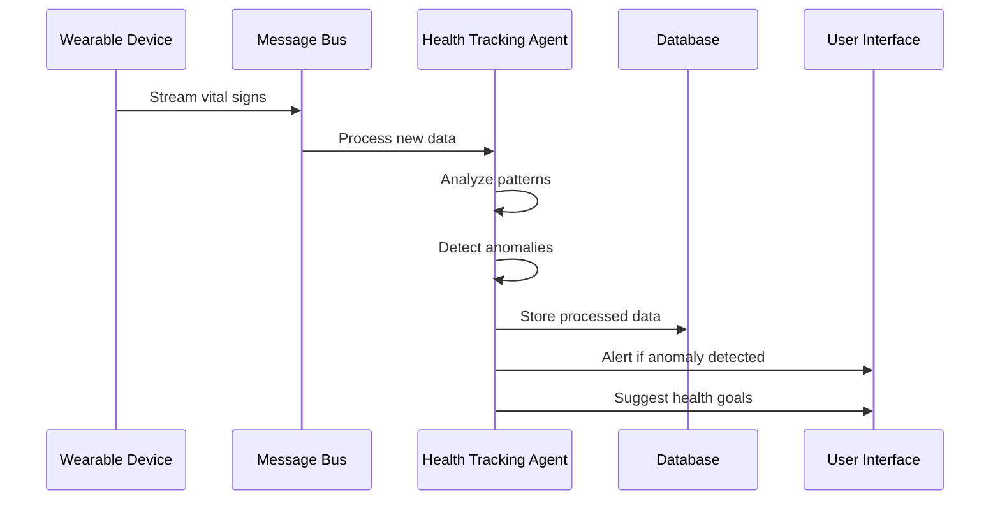
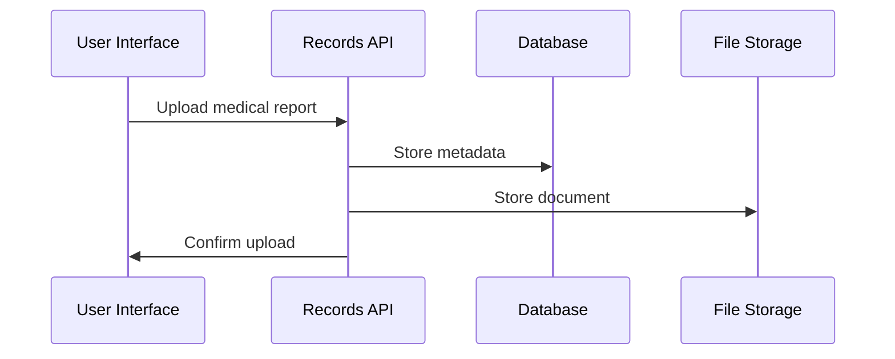

# VitaSense Personal Physician Assistant (PPA) - Implementation Guide

## Table of Contents
1. [Project Overview](#1-project-overview)
2. [System Architecture](#2-system-architecture)
   - [High-Level Architecture](#21-high-level-architecture)
   - [Microservices Breakdown](#22-microservices-breakdown)
   - [Data Flow](#23-data-flow)
   - [Agentic System Architecture](#24-agentic-system-architecture)
   - [Agentic Capabilities by Domain](#25-agentic-capabilities-by-domain)
   - [Agentic System Integration](#26-agentic-system-integration)
3. [Technical Stack](#3-technical-stack)
4. [Non-Functional Requirements](#4-non-functional-requirements)
   - [4.1 Security & Communication](#41-security--communication)
      - [Mutual TLS (mTLS)](#mutual-tls-mtls)
   - [4.2 Observability](#42-observability)
      - [Structured Logging](#structured-logging)
      - [Metrics Collection](#metrics-collection)
      - [Distributed Tracing](#distributed-tracing)
   - [4.3 Resilience Patterns](#43-resilience-patterns)
      - [Retries & Timeouts](#retries--timeouts)
      - [Circuit Breaking](#circuit-breaking)
   - [4.4 Policy Enforcement](#44-policy-enforcement)
      - [Rate Limiting](#rate-limiting)
      - [Role-Based Access Control](#role-based-access-control)
   - [4.5 Deployment Strategy](#45-deployment-strategy)
      - [Canary Releases](#canary-releases)
      - [Feature Flags](#feature-flags)
5. [Directory Structure](#5-directory-structure)
6. [Implementation Steps](#6-implementation-steps)
7. [API Documentation](#7-api-documentation)
8. [Testing & Deployment](#8-testing--deployment)

## 1. Project Overview

### 1.1 Purpose
VitaSense PPA is a comprehensive health platform that combines medical data management, AI-driven insights, and healthcare provider collaboration. The system is designed to be modular, scalable, and secure, with a focus on user privacy and data protection.

### 1.2 Core Features
- User authentication and profile management
- Health data tracking and monitoring
- Medical records management
- AI-powered health insights
- Healthcare provider integration
- Nutrition and activity tracking
- Lab results and biomarker monitoring
- Voice and multimodal input processing
- Genomic data integration
- E-commerce capabilities
- Analytics and reporting

### 1.3 User Personas
1. **Patients**
   - Track health metrics
   - Manage medications
   - View insights
   - Connect with providers

2. **Healthcare Providers**
   - Access patient records
   - Provide annotations
   - Monitor patient progress
   - Generate reports

3. **Administrators**
   - Manage users
   - Monitor system health
   - Handle compliance
   - Manage content

### 1.4 Functional Requirements

#### 1.4.1 User Management
1. **Authentication & Authorization**
   - Secure user registration and login
   - Multi-factor authentication support
   - Role-based access control
   - Session management
   - Password reset and recovery
   - OAuth integration for third-party providers

2. **Profile Management**
   - Personal information management
   - Health profile creation and updates
   - Privacy settings configuration
   - Notification preferences
   - Device management
   - Data export capabilities

#### 1.4.2 Health Data Management
1. **Vital Signs Tracking**
   - Real-time vital signs monitoring
   - Historical data storage and retrieval
   - Trend analysis and visualization
   - Anomaly detection and alerts
   - Custom range settings
   - Data export capabilities

2. **Medical Records**
   - Lab results management
   - Imaging data storage
   - Clinical notes and reports
   - Document version control
   - Secure sharing with providers
   - OCR for document processing

3. **Medication Management**
   - Medication tracking
   - Dosage scheduling
   - Refill reminders
   - Drug interaction checking
   - Side effect monitoring
   - Prescription history

#### 1.4.3 AI & Analytics
1. **Health Insights**
   - Personalized health recommendations
   - Risk assessment and prediction
   - Pattern recognition
   - Trend analysis
   - Anomaly detection
   - Health score calculation

2. **Nutrition Analysis**
   - Food logging and tracking
   - Nutritional analysis
   - Meal recommendations
   - Dietary pattern recognition
   - Food-drug interaction warnings
   - Nutritional goal setting

3. **Genomic Analysis**
   - Genetic data integration
   - Risk factor identification
   - Personalized recommendations
   - Research updates
   - Family history tracking
   - Genetic counseling support

#### 1.4.4 Provider Integration
1. **Provider Communication**
   - Secure messaging
   - Appointment scheduling
   - Telehealth integration
   - Care plan sharing
   - Progress reporting
   - Emergency alerts

2. **Clinical Support**
   - Patient summary generation
   - Treatment plan management
   - Progress monitoring
   - Clinical decision support
   - Research access
   - Documentation tools

#### 1.4.5 Data Processing
1. **Voice & Input Processing**
   - Voice command recognition
   - Natural language processing
   - Multimodal input support
   - Intent recognition
   - Entity extraction
   - Context understanding

2. **Data Integration**
   - Wearable device integration
   - Health app synchronization
   - Medical device connectivity
   - Lab result integration
   - Pharmacy integration
   - Insurance data access

#### 1.4.6 Reporting & Analytics
1. **Health Reports**
   - Custom report generation
   - Trend visualization
   - Progress tracking
   - Goal monitoring
   - Compliance reporting
   - Research analytics

2. **System Analytics**
   - Usage statistics
   - Performance metrics
   - User engagement
   - System health monitoring
   - Error tracking
   - Resource utilization

#### 1.4.7 E-commerce Features
1. **Product Management**
   - Health product catalog
   - Inventory management
   - Order processing
   - Payment integration
   - Shipping management
   - Returns handling

2. **Subscription Services**
   - Subscription management
   - Billing automation
   - Usage tracking
   - Renewal processing
   - Discount management
   - Payment history

#### 1.4.8 Compliance & Security
1. **Data Protection**
   - HIPAA compliance
   - GDPR compliance
   - Data encryption
   - Access control
   - Audit logging
   - Data retention

2. **Privacy Management**
   - Consent management
   - Data sharing controls
   - Privacy policy enforcement
   - Data anonymization
   - Access revocation
   - Privacy impact assessment

## 2. System Architecture

### 2.1 High-Level Architecture
```
┌─────────────────┐     ┌─────────────────┐     ┌─────────────────┐
│   Client Apps   │     │   API Gateway   │     │  Microservices  │
│  (Web/Mobile)   │────▶│  (FastAPI)      │────▶│  (Python)       │
└─────────────────┘     └─────────────────┘     └─────────────────┘
                                                         │
                                                         ▼
┌─────────────────┐     ┌─────────────────┐     ┌─────────────────┐
│   Analytics     │     │   Message Bus   │     │   Databases     │
│   (DuckDB)      │◀───▶│   (Kafka)       │◀───▶│  (PostgreSQL)   │
└─────────────────┘     └─────────────────┘     └─────────────────┘
```

### 2.2 Microservices Breakdown

1. **Auth Service**
   - User authentication
   - Session management
   - Password reset
   - Email verification
   - **Agentic?** ❌ (Must be deterministic and secure)

2. **User Profile Service**
   - Profile management
   - Demographics
   - Preferences
   - **Agentic?** ❌ (Static data management)

3. **Health Tracking Service**
   - Vitals monitoring
   - Symptoms tracking
   - Health goals
   - Metrics collection
   - **Agentic Layer**:
     - Suggests goals based on patterns
     - Detects deviations from normal ranges
     - Monitors trends and changes
     - Alerts on significant changes

4. **Device Data Service**
   - Wearable integration
   - Sensor data processing
   - Device management
   - **Agentic Layer**:
     - Flags missing or corrupt data
     - Detects device anomalies
     - Suggests device calibration
     - Monitors data quality

5. **Nutrition Service**
   - Food logging
   - Meal tracking
   - Supplement management
   - AI food analysis
   - **Agentic Layer**:
     - AI photo analysis of food
     - Warns on nutritional imbalances
     - Suggests meal improvements
     - Tracks dietary patterns

6. **Medical Records Service**
   - Lab results
   - Imaging
   - Reports
   - Documents
   - **Agentic?** ❌ (Static data storage)

7. **Doctor Collaboration Service**
   - Provider management
   - Patient-provider relationships
   - Clinical notes
   - Report templates
   - **Agentic Layer**:
     - Generates patient summaries
     - Flags priority items
     - Suggests follow-ups
     - Prepares report templates

8. **AI Insights Service**
   - Health insights
   - Risk detection
   - Anomaly alerts
   - Recommendations
   - **Agentic Layer**:
     - Proactive risk detection
     - Personalized recommendations
     - Pattern recognition
     - Health trend analysis

9. **Explainability Service**
   - Event tracking
   - Causal inference
   - Timeline generation
   - **Agentic Layer**:
     - Builds causal graphs
     - Explains health changes
     - Generates timelines
     - Identifies correlations

10. **Voice & Input Service**
    - Voice processing
    - OCR
    - Multimodal input
    - **Agentic Layer**:
      - Converts voice to health logs
      - Extracts medical terms
      - Identifies intents
      - Processes multimodal data

11. **Genomics Service**
    - Genetic data
    - Biomarker tracking
    - Risk assessment
    - **Agentic Layer**:
      - Interprets genetic variants
      - Maps genes to health risks
      - Suggests preventive measures
      - Updates risk profiles

12. **Knowledge Graph Service**
    - Medical literature
    - Term relationships
    - Interaction mapping
    - **Agentic Layer**:
      - Updates interaction rules
      - Learns from new research
      - Adapts to new findings
      - Maintains knowledge base

13. **Analytics Service**
    - Health metrics
    - Trend analysis
    - Reporting
    - Dashboard data
    - **Agentic Layer**:
      - Detects anomalies
      - Generates insights
      - Suggests optimizations
      - Predicts trends

14. **E-commerce Service**
    - Product management
    - Order processing
    - Inventory tracking
    - **Agentic?** ❌ (Transactional system)

15. **Consent & Audit Service**
    - Privacy management
    - Audit logging
    - Compliance tracking
    - **Agentic?** ❌ (Compliance-focused)

### 2.3 Data Flow

1. **Real-time Data**
   - Device data → Kafka → Stream Buffer → Processing
   - Voice input → Processing → Event Logs
   - Health metrics → Analytics → Insights

2. **Batch Processing**
   - Daily aggregations
   - Weekly reports
   - Monthly insights
   - Data cleanup

3. **AI Processing**
   - Model training
   - Prediction generation
   - Insight creation
   - Anomaly detection

4. **Service Flow Examples**

#### 4.1 Agentic Service Example: Health Tracking Service



**Input/Output Flow:**
1. **Input Sources:**
   - Real-time vital signs from wearables
   - Historical health data
   - User-reported symptoms
   - Environmental factors

2. **Processing Steps:**
   ```python
   class HealthTrackingAgent:
       async def process_vital_signs(self, data: VitalSignsData):
           # 1. Validate and normalize data
           normalized_data = self.normalize_data(data)
           
           # 2. Detect anomalies
           anomalies = self.detect_anomalies(normalized_data)
           
           # 3. Update health patterns
           patterns = self.update_patterns(normalized_data)
           
           # 4. Generate insights
           insights = self.generate_insights(patterns)
           
           # 5. Make decisions
           actions = self.decide_actions(insights, anomalies)
           
           return {
               'processed_data': normalized_data,
               'anomalies': anomalies,
               'insights': insights,
               'recommended_actions': actions
           }
   ```

3. **Output Actions:**
   - Store processed data
   - Generate alerts
   - Update health goals
   - Send recommendations
   - Trigger follow-up actions

4. **Example Scenario:**
   ```
   Input: Blood pressure reading (145/95)
   Processing:
   - Compare with baseline (120/80)
   - Check recent trends
   - Consider time of day
   - Evaluate stress factors
   
   Output:
   - Alert: "Blood pressure elevated"
   - Recommendation: "Consider stress reduction"
   - Action: Schedule follow-up check
   - Update: Health risk profile
   ```

#### 4.2 Non-Agentic Service Example: Medical Records Service



**Input/Output Flow:**
1. **Input Sources:**
   - Medical reports
   - Lab results
   - Imaging files
   - Clinical notes

2. **Processing Steps:**
   ```python
   class MedicalRecordsService:
       async def store_medical_report(self, report: MedicalReport):
           # 1. Validate report format
           self.validate_report(report)
           
           # 2. Extract metadata
           metadata = self.extract_metadata(report)
           
           # 3. Store document
           storage_path = self.store_document(report)
           
           # 4. Update database
           record = self.create_record(metadata, storage_path)
           
           return {
               'record_id': record.id,
               'storage_path': storage_path,
               'metadata': metadata
           }
   ```

3. **Output Actions:**
   - Store document
   - Update database
   - Generate access URL
   - Send confirmation

4. **Example Scenario:**
   ```
   Input: PDF lab report
   Processing:
   - Validate PDF format
   - Extract patient ID
   - Extract test results
   - Generate metadata
   
   Output:
   - Stored file path
   - Database record
   - Access URL
   - Confirmation message
   ```

5. **Key Differences:**
   - **Agentic Service:**
     - Makes autonomous decisions
     - Learns from patterns
     - Proactively generates insights
     - Adapts to new information
     - Maintains state
   
   - **Non-Agentic Service:**
     - Follows predefined rules
     - Performs deterministic operations
     - Responds to direct requests
     - Maintains data integrity
     - No autonomous decision-making

### 2.4 Agentic System Architecture

```
┌─────────────────────────────────────────────────────────┐
│                    Agentic Layer                        │
├─────────────────────────────────────────────────────────┤
│  ┌─────────────┐  ┌─────────────┐  ┌─────────────┐     │
│  │  Health     │  │  Nutrition  │  │  AI         │     │
│  │  Tracking   │  │  Analysis   │  │  Insights   │     │
│  └─────────────┘  └─────────────┘  └─────────────┘     │
│                                                         │
│  ┌─────────────┐  ┌─────────────┐  ┌─────────────┐     │
│  │  Device     │  │  Doctor     │  │  Voice      │     │
│  │  Monitoring │  │  Assistant  │  │  Processing │     │
│  └─────────────┘  └─────────────┘  └─────────────┘     │
│                                                         │
│  ┌─────────────┐  ┌─────────────┐  ┌─────────────┐     │
│  │  Genomics   │  │  Knowledge  │  │ Analytics   │     │
│  │  Analysis   │  │  Graph      │  │  Engine     │     │
│  └─────────────┘  └─────────────┘  └─────────────┘     │
└─────────────────────────────────────────────────────────┘
```

### 2.5 Agentic Capabilities by Domain

#### Health Tracking Agent
```python
class HealthTrackingAgent:
    def monitor_vitals(self):
        """Monitor vital signs for anomalies"""
        pass

    def suggest_goals(self):
        """Suggest health goals based on patterns"""
        pass

    def detect_deviations(self):
        """Detect deviations from normal ranges"""
        pass

    def analyze_trends(self):
        """Analyze health trends over time"""
        pass
```

#### Nutrition Analysis Agent
```python
class NutritionAnalysisAgent:
    def analyze_food_photo(self):
        """Analyze food photos for nutritional content"""
        pass

    def check_balance(self):
        """Check nutritional balance"""
        pass

    def suggest_improvements(self):
        """Suggest dietary improvements"""
        pass

    def track_patterns(self):
        """Track dietary patterns"""
        pass
```

#### AI Insights Agent
```python
class AIInsightsAgent:
    def detect_risks(self):
        """Detect health risks proactively"""
        pass

    def generate_recommendations(self):
        """Generate personalized recommendations"""
        pass

    def analyze_patterns(self):
        """Analyze health patterns"""
        pass

    def predict_trends(self):
        """Predict health trends"""
        pass
```

#### Doctor Assistant Agent
```python
class DoctorAssistantAgent:
    def generate_summaries(self):
        """Generate patient summaries"""
        pass

    def flag_priorities(self):
        """Flag priority items"""
        pass

    def suggest_followups(self):
        """Suggest follow-up actions"""
        pass

    def prepare_reports(self):
        """Prepare report templates"""
        pass
```

#### Voice Processing Agent
```python
class VoiceProcessingAgent:
    def convert_to_logs(self):
        """Convert voice to health logs"""
        pass

    def extract_terms(self):
        """Extract medical terms"""
        pass

    def identify_intents(self):
        """Identify user intents"""
        pass

    def process_multimodal(self):
        """Process multimodal data"""
        pass
```

#### Genomics Analysis Agent
```python
class GenomicsAnalysisAgent:
    def interpret_variants(self):
        """Interpret genetic variants"""
        pass

    def map_risks(self):
        """Map genes to health risks"""
        pass

    def suggest_prevention(self):
        """Suggest preventive measures"""
        pass

    def update_profiles(self):
        """Update risk profiles"""
        pass
```

#### Knowledge Graph Agent
```python
class KnowledgeGraphAgent:
    def update_rules(self):
        """Update interaction rules"""
        pass

    def learn_research(self):
        """Learn from new research"""
        pass

    def adapt_findings(self):
        """Adapt to new findings"""
        pass

    def maintain_knowledge(self):
        """Maintain knowledge base"""
        pass
```

### 2.6 Agentic System Integration

1. **Event-Driven Architecture**
   - Agents subscribe to relevant events
   - Trigger actions based on events
   - Maintain state through event logs
   - Coordinate through message bus

2. **Learning & Adaptation**
   - Continuous model updates
   - Pattern recognition
   - Feedback incorporation
   - Performance monitoring

3. **Decision Making**
   - Rule-based decisions
   - ML-based predictions
   - Hybrid approaches
   - Confidence scoring

4. **Communication Flow**
   ```
   Event → Agent → Decision → Action → Event
   ```

5. **State Management**
   - Event sourcing
   - CQRS pattern
   - Temporal reasoning
   - State persistence

## 3. Technical Stack

### 3.1 Core Technologies
- **Backend**: Python 3.10+
- **API Framework**: FastAPI
- **Database**: PostgreSQL 12+
- **Vector Search**: pgvector + Qdrant
- **Time Series**: TimescaleDB
- **Analytics**: DuckDB
- **Message Bus**: Kafka
- **Authentication**: Supabase Auth
- **Containerization**: Docker
- **Orchestration**: Docker Compose (dev) / Kubernetes (prod)

### 3.2 Required Extensions
```sql
CREATE EXTENSION IF NOT EXISTS "timescaledb";
CREATE EXTENSION IF NOT EXISTS "pgvector";
CREATE EXTENSION IF NOT EXISTS "pg_cron";
CREATE EXTENSION IF NOT EXISTS "duckdb_fdw";
CREATE EXTENSION IF NOT EXISTS "pg_kafka";
CREATE EXTENSION IF NOT EXISTS "http";
```

### 3.3 Dependencies
```python
# requirements.txt
fastapi>=0.68.0
uvicorn>=0.15.0
sqlalchemy>=1.4.0
psycopg2-binary>=2.9.0
python-jose>=3.3.0
passlib>=1.7.4
python-multipart>=0.0.5
pydantic>=1.8.0
python-dotenv>=0.19.0
httpx>=0.23.0
redis>=4.0.0
kafka-python>=2.0.0
duckdb>=0.5.0
qdrant-client>=0.7.0
langchain>=0.0.200
```

### 3.4 Data Management & Storage

#### 3.4.1 Data Retention Strategy
1. **Recent Data (Detailed)**
   - Device data: 1 year retention
   - Event logs: 6 months retention
   - Voice logs: 3 months retention
   - Vital signs: 1 year retention
   - Full resolution data storage
   - Optimized for real-time queries

2. **Historical Data (Aggregated)**
   - Device data: 5 years retention
   - Event logs: 2 years retention
   - Voice logs: 1 year retention
   - Vital signs: 5 years retention
   - Daily aggregations
   - Statistical summaries

3. **Data Migration**
   - Automatic daily migration
   - Statistical preservation
   - Storage optimization
   - Historical analysis support

#### 3.4.2 Time-Series Optimizations
1. **Hypertables**
   - Daily chunk partitioning
   - Automatic chunk management
   - Query performance optimization
   - Efficient data access

2. **Continuous Aggregates**
   - Hourly device data aggregation
   - Hourly vital signs aggregation
   - Automatic refresh policies
   - Performance optimization

3. **Data Management**
   - Daily cleanup automation
   - Aggregated table migration
   - Retention policy enforcement
   - Storage optimization

### 3.5 Analytics Configuration

#### 3.5.1 Data Aggregation
1. **Metrics Calculation**
   - Daily health metrics
   - Weekly trend analysis
   - Monthly insights
   - Automated refresh

2. **Performance Optimization**
   - Materialized views
   - Efficient indexing
   - Partitioned storage
   - Query optimization

3. **Dashboard Integration**
   - Pre-calculated metrics
   - Real-time updates
   - Historical trends
   - Custom views

4. **Data Refresh**
   - Daily automation
   - Incremental processing
   - Data validation
   - Error handling

### 3.6 Vector Search Architecture

#### 3.6.1 Collection Management
1. **Size-Based Routing**
   - pgvector for <10M vectors
   - Qdrant for 100M+ vectors
   - Automatic detection
   - Seamless routing

2. **Search Capabilities**
   - Cosine similarity
   - Configurable metrics
   - Threshold filtering
   - Payload filtering
   - Batch search

3. **Performance**
   - Local caching
   - Distributed search
   - Vector sync
   - Index management

4. **Data Sync**
   - Automatic vector sync
   - Incremental updates
   - Error handling
   - Consistency checks

### 3.7 Stream Processing

#### 3.7.1 Data Ingestion
1. **Architecture**
   - Kafka integration
   - Stream buffering
   - Batch processing
   - Error handling

2. **Processing Pipeline**
   - Configurable batches
   - Stream-specific processing
   - Error tracking
   - Automatic cleanup

3. **Optimization**
   - Partitioned buffers
   - Efficient indexing
   - Batch processing
   - Cleanup automation

4. **Monitoring**
   - Status tracking
   - Error logging
   - Performance monitoring
   - Cleanup automation

### 3.8 Enhanced Features

#### 3.8.1 Food Tracking
- Detailed nutritional information
- Barcode scanning
- Serving size management
- Allergen tracking
- Ingredient lists

#### 3.8.2 Exercise Monitoring
- GPS route tracking
- Elevation data
- Sport-specific metrics
- Intensity tracking
- Custom metrics

#### 3.8.3 Prescription Management
- Refill tracking
- Pharmacy integration
- Provider linking
- Status monitoring
- Prescription history

#### 3.8.4 Lab Test Management
- Standardized test definitions
- LOINC code integration
- Test panel support
- Reference ranges
- Preparation instructions

#### 3.8.5 Health Reporting
- Daily summaries
- Monthly wellness reports
- Customizable templates
- Trend analysis
- Achievement tracking

#### 3.8.6 User Feedback
- Recommendation feedback
- Insight ratings
- Report feedback
- Improvement tracking
- Satisfaction metrics

#### 3.8.7 Consent Management
- Granular consent types
- Data category tracking
- Retention periods
- Required consents
- Consent history

## 4. Non-Functional Requirements

### 4.1 Security & Communication

#### Mutual TLS (mTLS)
- **API Gateway**: HTTPS with valid SSL/TLS certificate
- **Service-to-Service**: mTLS for internal communication
- **Mobile Security**: Certificate pinning for enhanced security
- **Implementation**: ✅ **IMPLEMENTED** in `common/middleware/security.py`
  ```python
  # Example mTLS configuration for FastAPI
  from fastapi import FastAPI
  import ssl

  ssl_context = ssl.create_default_context(ssl.Purpose.CLIENT_AUTH)
  ssl_context.load_cert_chain(certfile="path/to/cert.pem", keyfile="path/to/key.pem")
  ssl_context.load_verify_locations(cafile="path/to/ca.pem")
  ssl_context.verify_mode = ssl.CERT_REQUIRED
  ```

### 4.2 Observability

#### Structured Logging
✅ **IMPLEMENTED** in `common/utils/logging.py`
```python
# common/utils/logging.py
import logging
from pythonjsonlogger import jsonlogger

def setup_json_logging(logger_name='uvicorn.access'):
    logger = logging.getLogger(logger_name)
    handler = logging.StreamHandler()
    formatter = jsonlogger.JsonFormatter('%(asctime)s %(levelname)s %(name)s %(message)s')
    handler.setFormatter(formatter)
    logger.addHandler(handler)
    logger.setLevel(logging.INFO)
```

#### Metrics Collection
✅ **IMPLEMENTED** with Prometheus and Grafana monitoring stack
```python
# Example Prometheus metrics in FastAPI
from prometheus_client import Counter, Histogram
from fastapi import FastAPI

app = FastAPI()

REQUEST_COUNT = Counter('request_count', 'Total request count', ['app_name', 'endpoint'])
REQUEST_LATENCY = Histogram('request_latency_seconds', 'Request latency', ['app_name', 'endpoint'])

@app.middleware("http")
async def metrics_middleware(request: Request, call_next):
    start_time = time.time()
    response = await call_next(request)
    process_time = time.time() - start_time
    REQUEST_LATENCY.labels(app_name="service_name", endpoint=request.url.path).observe(process_time)
    REQUEST_COUNT.labels(app_name="service_name", endpoint=request.url.path).inc()
    return response
```

**Monitoring Stack**:
- **Prometheus**: Metrics collection and storage
- **Grafana**: Visualization and dashboards
- **Redis**: Caching and state management
- **Auto-provisioned dashboards**: FastAPI metrics, application health, performance

#### Distributed Tracing
✅ **IMPLEMENTED** in `common/utils/opentelemetry_config.py`
```python
# common/utils/opentelemetry_config.py
from opentelemetry import trace
from opentelemetry.exporter.jaeger.thrift import JaegerExporter
from opentelemetry.instrumentation.fastapi import FastAPIInstrumentor

def configure_opentelemetry(app: FastAPI, service_name: str):
    resource = Resource.create({"service.name": service_name})
    provider = TracerProvider(resource=resource)
    jaeger_exporter = JaegerExporter(
        agent_host_name="jaeger-agent",
        agent_port=6831,
    )
    span_processor = BatchSpanProcessor(jaeger_exporter)
    provider.add_span_processor(span_processor)
    trace.set_tracer_provider(provider)
    FastAPIInstrumentor.instrument_app(app)
```

### 4.3 Resilience Patterns

#### Retries & Timeouts
✅ **IMPLEMENTED** in `common/utils/resilience.py` with Prometheus metrics
```python
# common/utils/resilience.py
import httpx
from tenacity import retry, stop_after_attempt, wait_fixed

@retry(stop=stop_after_attempt(3), wait=wait_fixed(2))
async def safe_api_call(url: str, json_data: dict = None):
    async with httpx.AsyncClient(timeout=5.0) as client:
        response = await client.post(url, json=json_data)
        response.raise_for_status()
        return response.json()
```

#### Circuit Breaking
✅ **IMPLEMENTED** in `common/utils/resilience.py` with isolated test metrics
```python
# common/utils/resilience.py
from pybreaker import CircuitBreaker

my_service_breaker = CircuitBreaker(fail_max=5, reset_timeout=30)

@my_service_breaker
async def call_critical_downstream(url, data):
    return await safe_api_call(url, data)
```

### 4.4 Policy Enforcement

#### Rate Limiting
✅ **IMPLEMENTED** in `common/middleware/rate_limiter.py` with Redis backend
```python
# common/middleware/rate_limiter.py
from fastapi_limiter import FastAPILimiter
from fastapi_limiter.depends import RateLimiter
import redis.asyncio as redis

@app.on_event("startup")
async def startup_event():
    redis_connection = redis.from_url("redis://localhost:6379", encoding="utf8", decode_responses=True)
    await FastAPILimiter.init(redis_connection)

@router.post("/auth/login", dependencies=[Depends(RateLimiter(times=5, seconds=60))])
async def login(credentials: UserLogin):
    pass
```

#### Role-Based Access Control
✅ **IMPLEMENTED** in `common/middleware/auth.py`
```python
# common/middleware/auth.py
from fastapi import Depends, HTTPException
from fastapi.security import OAuth2PasswordBearer

def require_role(role: str):
    async def role_checker(current_user: User = Depends(get_current_user)):
        if role not in current_user.roles:
            raise HTTPException(status_code=403, detail="Not enough permissions")
        return current_user
    return role_checker

@router.post("/admin/users", dependencies=[Depends(require_role("admin"))])
async def create_user(user: UserCreate):
    pass
```

### 4.5 Deployment Strategy

#### Canary Releases
```yaml
# kubernetes/canary-deployment.yaml
apiVersion: apps/v1
kind: Deployment
metadata:
  name: service-canary
spec:
  replicas: 1  # Start with 1 replica
  selector:
    matchLabels:
      app: service
  template:
    metadata:
      labels:
        app: service
        version: canary
    spec:
      containers:
      - name: service
        image: service:canary
```

#### Feature Flags
✅ **IMPLEMENTED** in `common/config/feature_flags.py` with Redis backend
```python
# common/config/feature_flags.py
FEATURE_FLAGS = {
    "new_dashboard_layout": True,
    "ai_lab_report_summary": False,
    "beta_user_group": ["user1@example.com", "user2@example.com"]
}

def is_feature_enabled(feature_name: str, user: dict = None):
    if feature_name in FEATURE_FLAGS and FEATURE_FLAGS[feature_name] is True:
        if feature_name == "ai_lab_report_summary" and user and user.get("email") not in FEATURE_FLAGS["beta_user_group"]:
            return False
        return True
    return False
```

### 4.6 Testing & Validation
✅ **IMPLEMENTED** comprehensive test suite in `tests/test_non_functional_requirements.py`
- Isolated Prometheus registries for testing
- Mock services for resilience testing
- Feature flag testing
- Security middleware testing
- Rate limiting validation

## 5. Directory Structure

```
vitasense-ppa/
├── .github/
│   └── workflows/
│       ├── ci.yml
│       └── cd.yml
├── apps/
│   ├── auth/
│   │   ├── api/
│   │   ├── models/
│   │   └── services/
│   ├── user_profile/
│   │   ├── api/
│   │   ├── models/
│   │   └── services/
│   ├── health_tracking/
│   │   ├── api/
│   │   ├── models/
│   │   ├── services/
│   │   └── agents/
│   │       ├── goal_suggestion/
│   │       ├── anomaly_detection/
│   │       └── trend_analysis/
│   ├── device_data/
│   │   ├── api/
│   │   ├── models/
│   │   ├── services/
│   │   └── agents/
│   │       ├── data_quality/
│   │       ├── anomaly_detection/
│   │       └── calibration/
│   ├── nutrition/
│   │   ├── api/
│   │   ├── models/
│   │   ├── services/
│   │   └── agents/
│   │       ├── food_analysis/
│   │       ├── balance_checker/
│   │       └── meal_suggestions/
│   ├── medical_records/
│   │   ├── api/
│   │   ├── models/
│   │   └── services/
│   ├── doctor_collaboration/
│   │   ├── api/
│   │   ├── models/
│   │   ├── services/
│   │   └── agents/
│   │       ├── summary_generator/
│   │       ├── priority_flagger/
│   │       └── followup_scheduler/
│   ├── ai_insights/
│   │   ├── api/
│   │   ├── models/
│   │   ├── services/
│   │   └── agents/
│   │       ├── risk_detector/
│   │       ├── recommendation_engine/
│   │       └── pattern_analyzer/
│   ├── explainability/
│   │   ├── api/
│   │   ├── models/
│   │   ├── services/
│   │   └── agents/
│   │       ├── causal_analyzer/
│   │       ├── timeline_builder/
│   │       └── correlation_finder/
│   ├── voice_input/
│   │   ├── api/
│   │   ├── models/
│   │   ├── services/
│   │   └── agents/
│   │       ├── speech_processor/
│   │       ├── intent_recognizer/
│   │       └── multimodal_processor/
│   ├── genomics/
│   │   ├── api/
│   │   ├── models/
│   │   ├── services/
│   │   └── agents/
│   │       ├── variant_interpreter/
│   │       ├── risk_mapper/
│   │       └── prevention_suggester/
│   ├── knowledge_graph/
│   │   ├── api/
│   │   ├── models/
│   │   ├── services/
│   │   └── agents/
│   │       ├── rule_updater/
│   │       ├── research_learner/
│   │       └── knowledge_maintainer/
│   ├── analytics/
│   │   ├── api/
│   │   ├── models/
│   │   ├── services/
│   │   └── agents/
│   │       ├── anomaly_detector/
│   │       ├── insight_generator/
│   │       └── trend_predictor/
│   ├── ecommerce/
│   │   ├── api/
│   │   ├── models/
│   │   └── services/
│   └── consent_audit/
│       ├── api/
│       ├── models/
│       └── services/
├── common/
│   ├── models/
│   │   ├── base.py
│   │   └── shared.py
│   ├── utils/
│   │   ├── logging.py
│   │   └── validation.py
│   ├── middleware/
│   │   ├── auth.py
│   │   └── error_handling.py
│   ├── config/
│   │   ├── settings.py
│   │   └── constants.py
│   └── agents/
│       ├── base_agent.py
│       ├── event_bus.py
│       ├── state_manager.py
│       └── learning_engine.py
├── infrastructure/
│   ├── docker/
│   │   ├── services/
│   │   └── agents/
│   ├── kubernetes/
│   │   ├── services/
│   │   └── agents/
│   └── terraform/
├── tests/
│   ├── unit/
│   │   ├── services/
│   │   └── agents/
│   ├── integration/
│   │   ├── services/
│   │   └── agents/
│   └── e2e/
├── docs/
│   ├── api/
│   ├── architecture/
│   │   ├── services/
│   │   └── agents/
│   └── deployment/
├── scripts/
│   ├── setup/
│   ├── migration/
│   └── maintenance/
├── .env.example
├── docker-compose.yml
├── README.md
└── requirements.txt
```

## 6. Implementation Steps

### Phase 1: Foundation Setup (Week 1-2)
1. **Project Initialization**
   - Set up repository
   - Configure development environment
   - Create basic directory structure
   - Set up CI/CD pipelines
   - Initialize version control
   - Set up code quality tools (pylint, black, mypy)
   - Configure pre-commit hooks
   - Set up development containers

2. **Database Setup**
   - Initialize PostgreSQL
   - Enable required extensions
   - Create schema from schema.sql
   - Set up migrations
   - Configure database backups
   - Set up database monitoring
   - Implement connection pooling
   - Configure database security

3. **Authentication Service**
   - Implement user registration
   - Set up JWT authentication
   - Create session management
   - Add email verification
   - Implement password policies
   - Set up OAuth providers
   - Add MFA support
   - Implement account recovery

4. **Infrastructure Setup**
   - Set up Docker environment
   - Configure Kubernetes clusters
   - Set up monitoring stack
   - Configure logging infrastructure
   - Set up alerting system
   - Configure network policies
   - Set up backup systems
   - Implement disaster recovery

### Phase 2: Core Services (Week 3-4)
1. **User Profile Service**
   - Create profile management
   - Implement preferences
   - Add health attributes
   - Set up data validation
   - Implement profile privacy
   - Add profile completion tracking
   - Set up profile synchronization
   - Implement profile export/import

2. **Health Tracking Service**
   - Set up vital signs tracking
   - Implement symptoms logging
   - Create health goals
   - Add metrics collection
   - Implement data validation
   - Set up trend analysis
   - Add anomaly detection
   - Implement health score calculation

3. **Device Data Service**
   - Create device management
   - Implement data sync
   - Add sensor processing
   - Set up device authentication
   - Implement data validation
   - Add device health monitoring
   - Set up firmware updates
   - Implement device troubleshooting

4. **Message Bus Setup**
   - Configure Kafka clusters
   - Set up message schemas
   - Implement event handlers
   - Add message validation
   - Set up dead letter queues
   - Implement retry policies
   - Add message monitoring
   - Set up message archiving

### Phase 3: Medical & Analytics (Week 5-6)
1. **Medical Records Service**
   - Implement lab results
   - Add imaging support
   - Create report management
   - Set up document storage
   - Implement OCR processing
   - Add data extraction
   - Set up version control
   - Implement audit logging

2. **Analytics Service**
   - Set up DuckDB integration
   - Create aggregation jobs
   - Implement reporting
   - Add data visualization
   - Set up real-time analytics
   - Implement predictive models
   - Add custom metrics
   - Set up data export

3. **Knowledge Graph Service**
   - Set up vector search
   - Create medical terms
   - Implement interactions
   - Add semantic search
   - Set up knowledge updates
   - Implement relationship inference
   - Add validation rules
   - Set up knowledge export

4. **Data Pipeline Setup**
   - Configure ETL processes
   - Set up data validation
   - Implement data quality checks
   - Add data transformation
   - Set up pipeline monitoring
   - Implement error handling
   - Add data lineage
   - Set up pipeline scheduling

### Phase 4: AI & Advanced Features (Week 7-8)
1. **AI Insights Service**
   - Implement model training
   - Create prediction pipeline
   - Add anomaly detection
   - Set up model versioning
   - Implement A/B testing
   - Add model monitoring
   - Set up feature store
   - Implement model explainability

2. **Explainability Service**
   - Create event tracking
   - Implement causal inference
   - Add timeline generation
   - Set up correlation analysis
   - Implement root cause analysis
   - Add impact assessment
   - Set up visualization
   - Implement recommendation engine

3. **Voice & Input Service**
   - Set up voice processing
   - Implement OCR
   - Add multimodal support
   - Set up intent recognition
   - Implement entity extraction
   - Add language processing
   - Set up voice commands
   - Implement feedback loop

4. **AI Infrastructure Setup**
   - Configure GPU resources
   - Set up model serving
   - Implement caching
   - Add load balancing
   - Set up model registry
   - Implement model deployment
   - Add performance monitoring
   - Set up resource scaling

### Phase 5: Integration & Testing (Week 9-10)
1. **Service Integration**
   - Connect all services
   - Implement message bus
   - Add error handling
   - Set up service discovery
   - Implement circuit breakers
   - Add retry mechanisms
   - Set up load balancing
   - Implement service mesh

2. **Testing**
   - Unit tests
   - Integration tests
   - End-to-end tests
   - Performance tests
   - Security tests
   - Load tests
   - Chaos testing
   - Accessibility tests

3. **Documentation**
   - API documentation
   - Architecture docs
   - Deployment guides
   - User guides
   - Developer guides
   - Security docs
   - Compliance docs
   - Troubleshooting guides

4. **Quality Assurance**
   - Set up code review process
   - Implement automated testing
   - Add performance benchmarks
   - Set up security scanning
   - Implement compliance checks
   - Add accessibility testing
   - Set up quality gates
   - Implement feedback loops

### Phase 6: Deployment & Monitoring (Week 11-12)
1. **Deployment**
   - Set up production environment
   - Configure monitoring
   - Implement logging
   - Set up CI/CD pipelines
   - Implement blue-green deployment
   - Add rollback mechanisms
   - Set up backup systems
   - Implement disaster recovery

2. **Performance Optimization**
   - Load testing
   - Performance tuning
   - Caching implementation
   - Database optimization
   - Network optimization
   - Resource scaling
   - Query optimization
   - Memory management

3. **Security & Compliance**
   - Security audit
   - Compliance checks
   - Privacy review
   - Penetration testing
   - Vulnerability scanning
   - Access control review
   - Data protection audit
   - Security monitoring

4. **Production Support**
   - Set up incident response
   - Implement SLAs
   - Add support documentation
   - Set up monitoring dashboards
   - Implement alerting
   - Add performance tracking
   - Set up user feedback
   - Implement continuous improvement

### Phase 7: Maintenance & Enhancement (Ongoing)
1. **System Maintenance**
   - Regular updates
   - Security patches
   - Performance monitoring
   - Capacity planning
   - Backup verification
   - System health checks
   - Resource optimization
   - Technical debt management

2. **Feature Enhancement**
   - User feedback analysis
   - Feature prioritization
   - Performance improvements
   - New feature development
   - Integration enhancements
   - UI/UX improvements
   - Mobile app updates
   - API versioning

3. **Data Management**
   - Data cleanup
   - Archive management
   - Data retention
   - Privacy compliance
   - Data quality checks
   - Analytics updates
   - Report generation
   - Data migration

4. **Support & Training**
   - User support
   - Documentation updates
   - Training materials
   - Knowledge base
   - FAQ maintenance
   - Support ticket system
   - User feedback system
   - Community engagement

## Next Steps

1. Review and confirm the implementation plan
2. Set up development environment
3. Begin with Phase 1 implementation
4. Regular progress reviews
5. Adjust plan based on feedback
6. Monitor and track KPIs
7. Gather and incorporate user feedback
8. Plan for future enhancements

## Validation Commands

# Complete environment validation
./setup.sh

# Run all tests
pytest tests/test_non_functional_requirements.py -v

# Check monitoring stack
docker-compose ps prometheus grafana redis
curl http://localhost:8000/metrics
curl http://localhost:9090/api/v1/targets
curl http://localhost:3002  # Grafana UI

# Validate virtual environment
python scripts/setup_venv.py validate
python scripts/validate_requirements.py