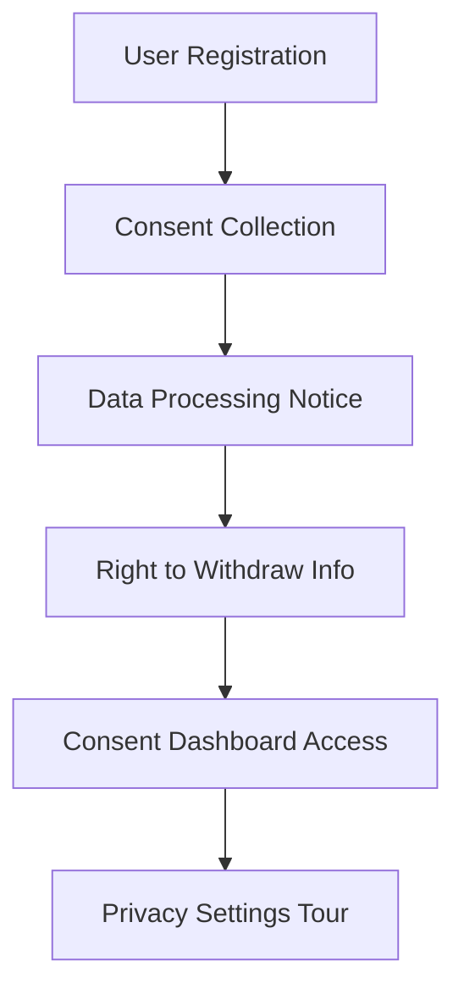
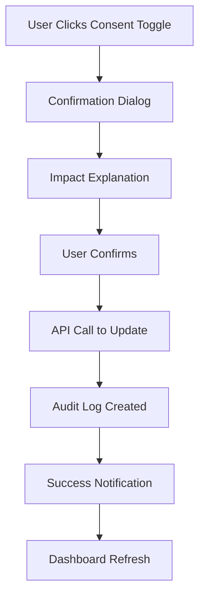
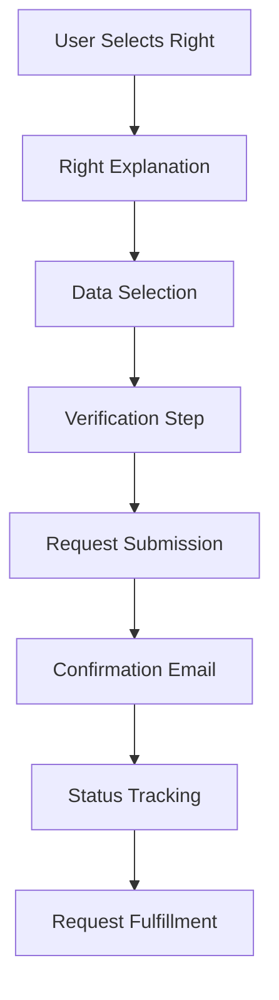

# 🎯 Consent Audit Service - Frontend Integration Specification

## Table of Contents
1. [Overview & Architecture](#1-overview--architecture)
2. [Core UI Components & Pages](#2-core-ui-components--pages)
3. [User Experience Flow](#3-user-experience-flow)
4. [Technical Implementation](#4-technical-implementation)
5. [UI/UX Design Guidelines](#5-uiux-design-guidelines)
6. [Security & Privacy Considerations](#6-security--privacy-considerations)
7. [Performance & Scalability](#7-performance--scalability)
8. [Testing Strategy](#8-testing-strategy)
9. [Implementation Timeline](#9-implementation-timeline)
10. [Success Metrics](#10-success-metrics)
11. [Documentation Requirements](#11-documentation-requirements)

---

## 1. Overview & Architecture

### Service Integration Points
- **Base URL**: `http://consent-audit.localhost` (via Traefik)
- **API Documentation**: `http://consent-audit.localhost/docs`
- **Health Check**: `http://consent-audit.localhost/health`

### Key User Flows to Implement
1. **Consent Management Dashboard**
2. **Data Subject Rights Exercise**
3. **Compliance Status Monitoring**
4. **Audit Trail Visualization**
5. **Privacy Settings Management**

### Architecture Overview
```
Frontend Application
├── Consent Management Module
│   ├── Dashboard Component
│   ├── Consent Toggle Components
│   └── History Viewer
├── Data Rights Module
│   ├── Rights Portal
│   ├── Request Wizard
│   └── Status Tracker
├── Compliance Module
│   ├── Status Monitor
│   ├── Checklist Viewer
│   └── Alert System
└── Audit Module
    ├── Timeline Viewer
    ├── Filter System
    └── Export Tools
```

---

## 2. Core UI Components & Pages

### 2.1 Consent Management Dashboard
**Route**: `/consent/dashboard`

**Components Needed**:
```typescript
interface ConsentDashboardProps {
  userId: string;
  onConsentUpdate: (consentId: string, action: 'grant' | 'revoke') => void;
  onDataRightsRequest: (right: DataSubjectRight) => void;
}
```

**Features**:
- **Active Consents Grid**: Show all current consents with status indicators
- **Consent Categories**: Group by purpose (Marketing, Analytics, Essential, etc.)
- **Quick Actions**: Grant/Revoke toggles for each consent type
- **Last Updated**: Timestamp of last consent change
- **Compliance Status**: Visual indicators for GDPR/HIPAA compliance

**API Endpoints Used**:
- `GET /api/v1/consent/status/{user_id}` - Current consent status
- `GET /api/v1/consent/history/{user_id}` - Consent change history
- `POST /api/v1/consent/exercise-right` - Exercise data subject rights

### 2.2 Data Subject Rights Portal
**Route**: `/consent/rights`

**Components Needed**:
```typescript
interface DataRightsPortalProps {
  userId: string;
  onRightExercise: (right: DataSubjectRight, details: any) => void;
}
```

**Rights to Implement**:
1. **Right of Access** - Download personal data
2. **Right of Rectification** - Correct inaccurate data
3. **Right of Erasure** - Delete personal data
4. **Right to Portability** - Export data in machine-readable format
5. **Right to Restriction** - Limit data processing
6. **Right to Object** - Object to processing
7. **Right to Withdraw Consent** - Revoke previously given consent

**API Endpoints Used**:
- `GET /api/v1/gdpr/data-subject-rights/{user_id}` - Available rights
- `POST /api/v1/gdpr/exercise-right` - Exercise specific right
- `GET /api/v1/consent/verify` - Verify consent compliance

### 2.3 Compliance Status Monitor
**Route**: `/consent/compliance`

**Components Needed**:
```typescript
interface ComplianceMonitorProps {
  userId?: string; // Optional - show system-wide if not provided
  refreshInterval?: number; // Auto-refresh interval in seconds
}
```

**Features**:
- **GDPR Compliance Score**: Visual gauge (0-100%)
- **HIPAA Compliance Status**: Pass/Fail indicators
- **Compliance Checklist**: Interactive checklist with status
- **Violation Alerts**: Real-time notifications of compliance issues
- **Recommendations**: Actionable suggestions for improvement

**API Endpoints Used**:
- `GET /api/v1/compliance/gdpr/status` - GDPR compliance status
- `GET /api/v1/compliance/hipaa/status` - HIPAA compliance status
- `GET /api/v1/compliance/overall/status` - Overall compliance
- `GET /api/v1/compliance/checklist/gdpr` - GDPR checklist
- `GET /api/v1/compliance/checklist/hipaa` - HIPAA checklist

### 2.4 Audit Trail Viewer
**Route**: `/consent/audit-trail`

**Components Needed**:
```typescript
interface AuditTrailViewerProps {
  userId?: string;
  dateRange?: { start: Date; end: Date };
  eventTypes?: AuditEventType[];
  onFilterChange: (filters: AuditFilters) => void;
}
```

**Features**:
- **Timeline View**: Chronological display of audit events
- **Filtering Options**: By date, event type, severity, actor
- **Event Details**: Expandable cards with full event information
- **Export Functionality**: Download audit logs in various formats
- **Real-time Updates**: WebSocket connection for live updates

**API Endpoints Used**:
- `GET /api/v1/audit/logs/user/{user_id}` - User-specific audit logs
- `GET /api/v1/audit/logs/my` - Current user's audit logs
- `GET /api/v1/audit/violations` - Compliance violations
- `GET /api/v1/audit/high-risk` - High-risk events

---

## 3. User Experience Flow

### 3.1 Onboarding Flow


**Implementation Steps**:
1. **Welcome Modal**: Explain consent management features
2. **Initial Consent Collection**: Granular consent options
3. **Data Rights Education**: Interactive tutorial on user rights
4. **Dashboard Introduction**: Guided tour of consent dashboard

### 3.2 Consent Update Flow


**Implementation Details**:
- **Confirmation Dialogs**: Clear explanation of consequences
- **Impact Assessment**: Show what features will be affected
- **Undo Options**: Allow reversal within grace period
- **Audit Trail**: Automatic logging of all changes

### 3.3 Data Rights Exercise Flow


**Implementation Details**:
- **Step-by-step Wizard**: Guided process for each right
- **Data Preview**: Show what data will be affected
- **Verification**: Multi-factor authentication for sensitive requests
- **Status Tracking**: Real-time updates on request progress

---

## 4. Technical Implementation

### 4.1 API Integration Layer
```typescript
// consent-audit-api.ts
class ConsentAuditAPI {
  private baseURL = 'http://consent-audit.localhost';
  
  // Consent Management
  async getConsentStatus(userId: string): Promise<ConsentStatus>
  async updateConsent(consentData: ConsentUpdate): Promise<ConsentResponse>
  async getConsentHistory(userId: string): Promise<ConsentHistory[]>
  
  // Data Subject Rights
  async getDataRights(userId: string): Promise<DataSubjectRights>
  async exerciseRight(rightData: RightExercise): Promise<RightResponse>
  
  // Compliance Monitoring
  async getComplianceStatus(userId?: string): Promise<ComplianceStatus>
  async getComplianceChecklist(type: 'gdpr' | 'hipaa'): Promise<ComplianceChecklist>
  
  // Audit Trail
  async getAuditLogs(filters: AuditFilters): Promise<AuditLog[]>
  async getViolations(filters: ViolationFilters): Promise<Violation[]>
}
```

### 4.2 State Management
```typescript
// consent-store.ts
interface ConsentState {
  // Consent Status
  activeConsents: ConsentRecord[];
  consentHistory: ConsentHistory[];
  
  // Data Rights
  availableRights: DataSubjectRight[];
  pendingRequests: RightRequest[];
  
  // Compliance
  gdprStatus: GDPRComplianceStatus;
  hipaaStatus: HIPAAComplianceStatus;
  
  // Audit Trail
  auditLogs: AuditLog[];
  violations: Violation[];
  
  // UI State
  loading: boolean;
  error: string | null;
  lastUpdated: Date;
}

// Actions
const consentActions = {
  fetchConsentStatus: (userId: string) => void;
  updateConsent: (consentData: ConsentUpdate) => void;
  exerciseRight: (rightData: RightExercise) => void;
  fetchComplianceStatus: (userId?: string) => void;
  fetchAuditLogs: (filters: AuditFilters) => void;
  clearError: () => void;
};
```

### 4.3 Real-time Updates
```typescript
// consent-websocket.ts
class ConsentWebSocket {
  private ws: WebSocket;
  
  connect(userId: string): void;
  subscribeToUpdates(topics: string[]): void;
  onConsentUpdate(callback: (update: ConsentUpdate) => void): void;
  onComplianceAlert(callback: (alert: ComplianceAlert) => void): void;
  onAuditEvent(callback: (event: AuditEvent) => void): void;
}
```

---

## 5. UI/UX Design Guidelines

### 5.1 Visual Design System
```css
/* Consent Status Indicators */
.consent-status {
  --status-granted: #10b981;
  --status-revoked: #ef4444;
  --status-pending: #f59e0b;
  --status-expired: #6b7280;
}

/* Compliance Score Visualization */
.compliance-score {
  --score-excellent: #10b981;
  --score-good: #3b82f6;
  --score-warning: #f59e0b;
  --score-critical: #ef4444;
}

/* Audit Event Severity */
.audit-severity {
  --severity-low: #6b7280;
  --severity-medium: #f59e0b;
  --severity-high: #ef4444;
  --severity-critical: #dc2626;
}
```

### 5.2 Accessibility Requirements
- **WCAG 2.1 AA Compliance**: All components must meet accessibility standards
- **Keyboard Navigation**: Full keyboard accessibility for all interactive elements
- **Screen Reader Support**: Proper ARIA labels and semantic HTML
- **Color Contrast**: Minimum 4.5:1 contrast ratio for text
- **Focus Indicators**: Clear focus states for all interactive elements

### 5.3 Responsive Design
```typescript
// Breakpoints
const breakpoints = {
  mobile: '320px',
  tablet: '768px',
  desktop: '1024px',
  wide: '1440px'
};

// Component Responsiveness
interface ResponsiveProps {
  mobile: ComponentConfig;
  tablet: ComponentConfig;
  desktop: ComponentConfig;
}
```

---

## 6. Security & Privacy Considerations

### 6.1 Authentication & Authorization
```typescript
// Authentication Requirements
interface AuthRequirements {
  // JWT Token Validation
  validateToken: (token: string) => Promise<boolean>;
  
  // Role-based Access
  hasPermission: (userId: string, permission: string) => boolean;
  
  // Multi-factor Authentication for Sensitive Operations
  requireMFA: (operation: SensitiveOperation) => boolean;
}
```

### 6.2 Data Protection
- **Encryption**: All data in transit and at rest
- **Data Minimization**: Only collect necessary data
- **Consent Verification**: Verify consent before data processing
- **Audit Logging**: Log all user interactions for compliance

### 6.3 Privacy by Design
```typescript
// Privacy Settings
interface PrivacySettings {
  // Data Retention
  dataRetentionPeriod: number; // days
  
  // Data Processing
  allowAnalytics: boolean;
  allowMarketing: boolean;
  allowThirdParty: boolean;
  
  // Communication Preferences
  emailNotifications: boolean;
  smsNotifications: boolean;
  pushNotifications: boolean;
}
```

---

## 7. Performance & Scalability

### 7.1 Performance Requirements
- **Page Load Time**: < 2 seconds for initial load
- **API Response Time**: < 500ms for most endpoints
- **Real-time Updates**: < 100ms latency for WebSocket events
- **Caching Strategy**: Implement appropriate caching for static data

### 7.2 Scalability Considerations
```typescript
// Pagination for Large Datasets
interface PaginationConfig {
  pageSize: number;
  maxPages: number;
  loadMoreThreshold: number;
}

// Lazy Loading
interface LazyLoadingConfig {
  threshold: number; // pixels from bottom
  batchSize: number;
  debounceTime: number; // ms
}
```

---

## 8. Testing Strategy

### 8.1 Unit Testing
```typescript
// Test Coverage Requirements
const testCoverage = {
  components: 90,
  utilities: 95,
  api: 85,
  integration: 80
};

// Test Scenarios
const testScenarios = [
  'Consent Grant Flow',
  'Consent Revoke Flow',
  'Data Rights Exercise',
  'Compliance Monitoring',
  'Audit Trail Navigation',
  'Error Handling',
  'Accessibility Testing'
];
```

### 8.2 Integration Testing
- **API Integration**: Test all API endpoints
- **Real-time Updates**: Test WebSocket connections
- **Error Scenarios**: Test error handling and recovery
- **Performance Testing**: Load testing for concurrent users

---

## 9. Implementation Timeline

### Phase 1: Core Components (Week 1-2)
- [ ] Consent Dashboard
- [ ] Basic Consent Management
- [ ] API Integration Layer
- [ ] State Management Setup

### Phase 2: Data Rights (Week 3-4)
- [ ] Data Subject Rights Portal
- [ ] Right Exercise Workflows
- [ ] Request Tracking System
- [ ] Email Notifications

### Phase 3: Compliance & Audit (Week 5-6)
- [ ] Compliance Status Monitor
- [ ] Audit Trail Viewer
- [ ] Real-time Updates
- [ ] Export Functionality

### Phase 4: Polish & Testing (Week 7-8)
- [ ] Accessibility Implementation
- [ ] Performance Optimization
- [ ] Comprehensive Testing
- [ ] Documentation

---

## 10. Success Metrics

### 10.1 User Engagement
- **Consent Management Adoption**: > 80% of users access consent dashboard
- **Data Rights Exercise**: > 60% of users exercise at least one right
- **Compliance Awareness**: > 70% of users understand their rights

### 10.2 Technical Metrics
- **Page Load Performance**: < 2 seconds average
- **API Response Time**: < 500ms average
- **Error Rate**: < 1% for critical operations
- **Accessibility Score**: 100% WCAG 2.1 AA compliance

### 10.3 Compliance Metrics
- **GDPR Compliance Score**: > 95%
- **HIPAA Compliance Score**: > 95%
- **Audit Trail Completeness**: 100% of user actions logged
- **Consent Verification**: 100% of data processing verified

---

## 11. Documentation Requirements

### 11.1 Technical Documentation
- API integration guide
- Component library documentation
- State management patterns
- Testing guidelines

### 11.2 User Documentation
- Privacy policy updates
- User rights explanation
- Consent management guide
- Troubleshooting guide

### 11.3 Compliance Documentation
- GDPR compliance report
- HIPAA compliance report
- Audit trail documentation
- Data processing records

---

## Appendix

### A. API Endpoint Reference
| Endpoint | Method | Description |
|----------|--------|-------------|
| `/api/v1/consent/status/{user_id}` | GET | Get user consent status |
| `/api/v1/consent/history/{user_id}` | GET | Get consent history |
| `/api/v1/consent/verify` | POST | Verify consent compliance |
| `/api/v1/gdpr/data-subject-rights/{user_id}` | GET | Get available rights |
| `/api/v1/gdpr/exercise-right` | POST | Exercise data subject right |
| `/api/v1/compliance/gdpr/status` | GET | Get GDPR compliance status |
| `/api/v1/compliance/hipaa/status` | GET | Get HIPAA compliance status |
| `/api/v1/audit/logs/user/{user_id}` | GET | Get user audit logs |
| `/api/v1/audit/violations` | GET | Get compliance violations |

### B. Error Handling
```typescript
interface ErrorResponse {
  error: string;
  code: string;
  details?: any;
  timestamp: string;
}

const errorCodes = {
  CONSENT_NOT_FOUND: 'CONSENT_001',
  INVALID_RIGHT_REQUEST: 'RIGHTS_001',
  COMPLIANCE_VIOLATION: 'COMPLIANCE_001',
  AUDIT_LOG_ERROR: 'AUDIT_001'
};
```

### C. Data Models
```typescript
interface ConsentRecord {
  id: string;
  userId: string;
  type: ConsentType;
  status: ConsentStatus;
  grantedAt: Date;
  expiresAt?: Date;
  purpose: string;
  dataCategories: string[];
}

interface DataSubjectRight {
  id: string;
  name: string;
  description: string;
  available: boolean;
  exerciseUrl: string;
}

interface ComplianceStatus {
  gdpr: {
    score: number;
    compliant: boolean;
    violations: number;
  };
  hipaa: {
    score: number;
    compliant: boolean;
    violations: number;
  };
}
```

---

**Document Version**: 1.0  
**Last Updated**: 2024-01-01  
**Author**: Personal Health Assistant Team  
**Review Cycle**: Monthly 