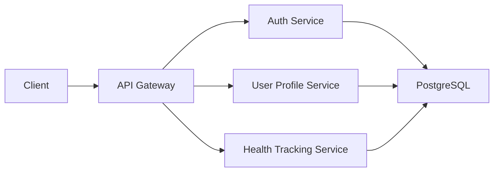
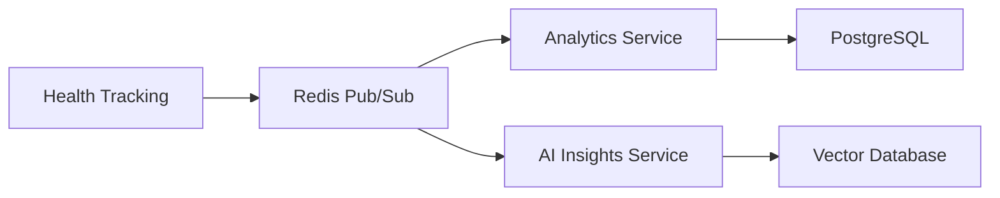
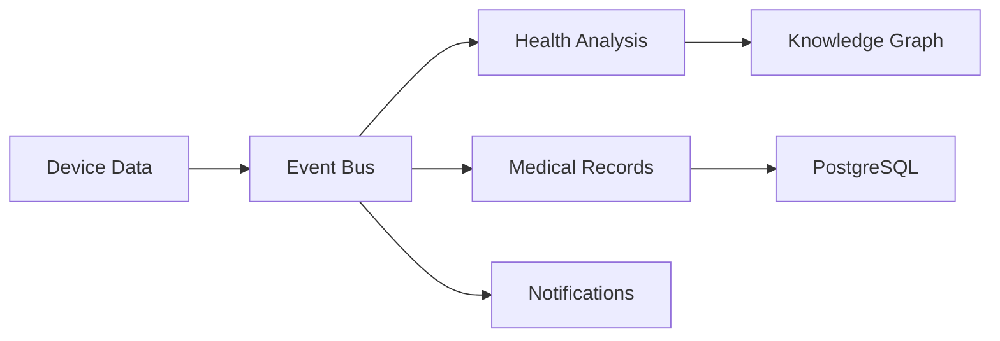

# Personal Health Assistant Platform - Complete Architecture Overview

## Table of Contents
1. [Platform Overview](#platform-overview)
2. [System Architecture](#system-architecture)
3. [Microservices Architecture](#microservices-architecture)
4. [Technology Stack](#technology-stack)
5. [Data Architecture](#data-architecture)
6. [Security Architecture](#security-architecture)
7. [Integration Patterns](#integration-patterns)
8. [Deployment Architecture](#deployment-architecture)
9. [Monitoring & Observability](#monitoring--observability)
10. [Scalability & Performance](#scalability--performance)
11. [Development Workflow](#development-workflow)
12. [API Architecture](#api-architecture)
13. [Data Flow](#data-flow)
14. [Compliance & Governance](#compliance--governance)
15. [Future Roadmap](#future-roadmap)

## Platform Overview

The Personal Health Assistant (PHA) is a comprehensive healthcare platform that provides personalized health management, medical analysis, and AI-powered insights through a microservices architecture. The platform integrates multiple healthcare domains including genomics, nutrition, medical records, and real-time health monitoring to deliver a holistic health experience.

### Core Value Proposition
- **Personalized Health Management**: AI-driven personalized health recommendations and insights
- **Comprehensive Health Tracking**: Multi-dimensional health data collection and analysis
- **Clinical Decision Support**: Evidence-based clinical recommendations and decision support
- **Secure & Compliant**: HIPAA and GDPR compliant with enterprise-grade security
- **Scalable & Reliable**: Cloud-native architecture designed for high availability and scalability

### Key Capabilities
- Real-time health monitoring and analytics
- Genomic data analysis and interpretation
- Medical records management and integration
- AI-powered health insights and predictions
- Secure provider-patient collaboration
- Comprehensive nutrition and lifestyle management
- Voice-enabled health interactions
- Knowledge graph-based medical reasoning

## System Architecture

### High-Level System Architecture
```
┌─────────────────────────────────────────────────────────────────────────────┐
│                           CLIENT APPLICATIONS                               │
├─────────────────────────────────────────────────────────────────────────────┤
│  Web App  │  Mobile App  │  Clinician App  │  Admin Panel  │  IoT Devices  │
└─────────────────────────────────────────────────────────────────────────────┘
                                    │
                                    ▼
┌─────────────────────────────────────────────────────────────────────────────┐
│                           API GATEWAY (TRAEFIK)                            │
├─────────────────────────────────────────────────────────────────────────────┤
│  Load Balancing  │  Rate Limiting  │  SSL/TLS  │  Authentication  │  CORS  │
└─────────────────────────────────────────────────────────────────────────────┘
                                    │
                                    ▼
┌─────────────────────────────────────────────────────────────────────────────┐
│                           MICROSERVICES LAYER                              │
├─────────────────────────────────────────────────────────────────────────────┤
│  Auth  │  User Profile  │  Health Tracking  │  Medical Records  │  Analytics │
│  AI Insights  │  Genomics  │  Nutrition  │  Voice Input  │  Device Data   │
│  Doctor Collab  │  Consent Audit  │  Knowledge Graph  │  Medical Analysis │
└─────────────────────────────────────────────────────────────────────────────┘
                                    │
                                    ▼
┌─────────────────────────────────────────────────────────────────────────────┐
│                           DATA LAYER                                       │
├─────────────────────────────────────────────────────────────────────────────┤
│  PostgreSQL  │  Neo4j  │  Qdrant  │  Redis  │  MinIO  │  Elasticsearch   │
└─────────────────────────────────────────────────────────────────────────────┘
                                    │
                                    ▼
┌─────────────────────────────────────────────────────────────────────────────┐
│                           INFRASTRUCTURE LAYER                             │
├─────────────────────────────────────────────────────────────────────────────┤
│  Kubernetes  │  Docker  │  Prometheus  │  Grafana  │  Jaeger  │  Istio     │
└─────────────────────────────────────────────────────────────────────────────┘
```

### Platform Components

#### 1. **Client Layer**
- **Web Application**: React-based responsive web interface
- **Mobile Applications**: iOS and Android native applications
- **Clinician Portal**: Healthcare provider interface
- **Administrative Dashboard**: Platform management interface
- **IoT Device Integration**: Wearables and medical devices

#### 2. **API Gateway Layer**
- **Traefik**: Reverse proxy and load balancer
- **Authentication**: JWT-based authentication
- **Rate Limiting**: API rate limiting and throttling
- **SSL/TLS**: End-to-end encryption
- **CORS**: Cross-origin resource sharing

#### 3. **Microservices Layer**
- **15 Core Services**: Specialized healthcare microservices
- **Service Mesh**: Inter-service communication and discovery
- **Event-Driven Architecture**: Asynchronous event processing
- **Circuit Breakers**: Fault tolerance and resilience

#### 4. **Data Layer**
- **PostgreSQL**: Primary relational database
- **Neo4j**: Knowledge graph database
- **Qdrant**: Vector database for semantic search
- **Redis**: Caching and session management
- **MinIO**: Object storage for files and media
- **Elasticsearch**: Search and analytics engine

#### 5. **Infrastructure Layer**
- **Kubernetes**: Container orchestration
- **Docker**: Containerization
- **Prometheus**: Metrics collection
- **Grafana**: Monitoring and visualization
- **Jaeger**: Distributed tracing
- **Istio**: Service mesh

## Microservices Architecture

### Service Overview

| Service | Port | Purpose | Key Features |
|---------|------|---------|--------------|
| **Auth Service** | 8000 | Authentication & Authorization | JWT, OAuth2, Role-based access |
| **User Profile Service** | 8001 | User management | Profile management, preferences |
| **Medical Records Service** | 8002 | EHR management | FHIR integration, document management |
| **Consent Audit Service** | 8003 | Consent management | HIPAA compliance, audit trails |
| **Doctor Collaboration Service** | 8004 | Provider collaboration | Secure messaging, care coordination |
| **Health Tracking Service** | 8005 | Health monitoring | Activity tracking, vital signs |
| **Device Data Service** | 8006 | IoT integration | Device management, data ingestion |
| **Health Analysis Service** | 8007 | Health analytics | Pattern recognition, risk assessment |
| **Knowledge Graph Service** | 8008 | Medical knowledge | Ontology management, semantic search |
| **Medical Analysis Service** | 8009 | Clinical analysis | Lab analysis, imaging analysis |
| **Nutrition Service** | 8010 | Nutrition management | Meal planning, dietary tracking |
| **Voice Input Service** | 8011 | Voice processing | Speech-to-text, voice commands |
| **Genomics Service** | 8012 | Genetic analysis | Variant analysis, ancestry analysis |
| **AI Insights Service** | 8200 | AI/ML insights | Predictive analytics, recommendations |
| **Analytics Service** | 8210 | Data analytics | Reporting, dashboards, insights |

### Service Communication Patterns

#### 1. **Synchronous Communication**


#### 2. **Asynchronous Communication**


#### 3. **Event-Driven Architecture**


### Service Dependencies

#### Core Dependencies
- **Auth Service**: Required by all services for authentication
- **User Profile Service**: Required by most services for user context
- **Medical Records Service**: Required by clinical services
- **Knowledge Graph Service**: Required by AI and analysis services

#### Data Dependencies
- **PostgreSQL**: Primary data store for most services
- **Redis**: Caching and session management
- **Neo4j**: Knowledge graph for medical reasoning
- **Qdrant**: Vector database for semantic search

## Technology Stack

### Backend Technologies
- **Python 3.11**: Primary programming language
- **FastAPI**: High-performance web framework
- **SQLAlchemy 2.0**: Modern ORM with async support
- **Pydantic**: Data validation and settings management
- **Celery**: Asynchronous task processing
- **Redis**: Caching and message broker

### Database Technologies
- **PostgreSQL 15**: Primary relational database
- **Neo4j 5.0**: Graph database for knowledge graph
- **Qdrant**: Vector database for embeddings
- **Redis 7**: In-memory data store
- **MinIO**: Object storage
- **Elasticsearch**: Search and analytics

### AI/ML Technologies
- **scikit-learn**: Machine learning algorithms
- **TensorFlow**: Deep learning framework
- **PyTorch**: Deep learning framework
- **Transformers**: Natural language processing
- **Sentence-Transformers**: Text embeddings
- **SHAP/LIME**: Model explainability

### DevOps & Infrastructure
- **Docker**: Containerization
- **Kubernetes**: Container orchestration
- **Traefik**: Reverse proxy and load balancer
- **Prometheus**: Metrics collection
- **Grafana**: Monitoring and visualization
- **Jaeger**: Distributed tracing
- **Istio**: Service mesh

### Security & Compliance
- **JWT**: JSON Web Tokens for authentication
- **OAuth2**: Authorization framework
- **bcrypt**: Password hashing
- **cryptography**: Encryption library
- **PyJWT**: JWT implementation
- **passlib**: Password hashing

## Data Architecture

### Data Flow Architecture
```
┌─────────────────┐    ┌─────────────────┐    ┌─────────────────┐
│   Data Sources  │    │   Data Ingestion│    │   Data Storage  │
│                 │    │                 │    │                 │
│ - IoT Devices   │───▶│ - API Gateway   │───▶│ - PostgreSQL    │
│ - Mobile Apps   │    │ - Event Bus     │    │ - Neo4j         │
│ - Web Apps      │    │ - Message Queue │    │ - Qdrant        │
│ - External APIs │    │ - Data Pipeline │    │ - Redis         │
└─────────────────┘    └─────────────────┘    └─────────────────┘
                                                       │
                                                       ▼
                                              ┌─────────────────┐
                                              │   Data Processing│
                                              │                 │
                                              │ - Analytics     │
                                              │ - AI/ML Models  │
                                              │ - ETL Pipelines │
                                              │ - Data Quality  │
                                              └─────────────────┘
                                                       │
                                                       ▼
                                              ┌─────────────────┐
                                              │   Data Delivery │
                                              │                 │
                                              │ - APIs          │
                                              │ - Dashboards    │
                                              │ - Reports       │
                                              │ - Notifications │
                                              └─────────────────┘
```

### Data Models

#### Core Entities
- **User**: Platform users (patients, providers, administrators)
- **Health Data**: Health metrics, vital signs, activity data
- **Medical Records**: Clinical documents, lab results, imaging
- **Genomic Data**: Genetic information, variants, analysis
- **Nutrition Data**: Food intake, meal plans, dietary preferences
- **Device Data**: IoT device data, sensor readings
- **Analytics Data**: Processed analytics and insights

#### Data Relationships
- **User ↔ Health Data**: One-to-many relationship
- **User ↔ Medical Records**: One-to-many relationship
- **User ↔ Genomic Data**: One-to-one relationship
- **Health Data ↔ Analytics**: Many-to-many relationship
- **Medical Records ↔ Knowledge Graph**: Many-to-many relationship

### Data Governance

#### Data Classification
- **PII (Personally Identifiable Information)**: Names, addresses, contact info
- **PHI (Protected Health Information)**: Medical records, health data
- **Sensitive Data**: Genomic data, financial information
- **Public Data**: General health information, educational content

#### Data Retention Policies
- **Active Data**: 7 years (HIPAA requirement)
- **Archived Data**: 10 years
- **Analytics Data**: 3 years
- **Log Data**: 1 year

## Security Architecture

### Security Layers

#### 1. **Network Security**
- **SSL/TLS**: End-to-end encryption
- **VPN**: Secure remote access
- **Firewall**: Network traffic filtering
- **DDoS Protection**: Distributed denial-of-service protection

#### 2. **Application Security**
- **Authentication**: Multi-factor authentication
- **Authorization**: Role-based access control (RBAC)
- **Input Validation**: Data validation and sanitization
- **SQL Injection Protection**: Parameterized queries

#### 3. **Data Security**
- **Encryption at Rest**: Database encryption
- **Encryption in Transit**: TLS encryption
- **Data Masking**: Sensitive data masking
- **Audit Logging**: Comprehensive audit trails

#### 4. **Infrastructure Security**
- **Container Security**: Image scanning and validation
- **Secrets Management**: Secure secret storage
- **Network Policies**: Kubernetes network policies
- **Security Monitoring**: Real-time security monitoring

### Compliance Framework

#### HIPAA Compliance
- **Privacy Rule**: Patient privacy protection
- **Security Rule**: Technical safeguards
- **Breach Notification**: Incident response procedures
- **Business Associate Agreements**: Third-party compliance

#### GDPR Compliance
- **Data Subject Rights**: Right to access, rectification, erasure
- **Data Processing**: Lawful basis for processing
- **Data Protection**: Technical and organizational measures
- **Breach Notification**: 72-hour notification requirement

## Integration Patterns

### Internal Service Integration

#### 1. **Synchronous Integration**
```python
# Service-to-service communication
async def get_user_health_data(user_id: str):
    # Call Health Tracking Service
    health_data = await health_tracking_service.get_data(user_id)
    
    # Call Analytics Service
    analytics = await analytics_service.analyze(health_data)
    
    # Call AI Insights Service
    insights = await ai_insights_service.generate_insights(analytics)
    
    return {
        "health_data": health_data,
        "analytics": analytics,
        "insights": insights
    }
```

#### 2. **Asynchronous Integration**
```python
# Event-driven communication
async def process_device_data(device_data: DeviceData):
    # Publish to event bus
    await event_bus.publish("device.data.received", device_data)
    
    # Services subscribe to events
    await health_tracking_service.process_device_data(device_data)
    await analytics_service.update_analytics(device_data)
    await ai_insights_service.update_insights(device_data)
```

### External System Integration

#### 1. **EHR Integration**
- **FHIR**: Fast Healthcare Interoperability Resources
- **HL7**: Healthcare messaging standards
- **Epic**: Epic EHR system integration
- **Cerner**: Cerner EHR system integration

#### 2. **Device Integration**
- **Apple HealthKit**: iOS health data integration
- **Google Fit**: Android health data integration
- **Fitbit API**: Fitbit device integration
- **Dexcom API**: Continuous glucose monitoring

#### 3. **Third-Party APIs**
- **USDA Food Database**: Nutritional information
- **Open Food Facts**: Food product database
- **Nutritionix**: Restaurant nutrition data
- **Weather API**: Environmental health factors

## Deployment Architecture

### Container Architecture
```
┌─────────────────────────────────────────────────────────────────────────────┐
│                           KUBERNETES CLUSTER                               │
├─────────────────────────────────────────────────────────────────────────────┤
│  Namespace: personal-health-assistant                                      │
├─────────────────────────────────────────────────────────────────────────────┤
│  Ingress Controller (Traefik)                                              │
├─────────────────────────────────────────────────────────────────────────────┤
│  Microservices Pods                                                        │
│  ┌─────────────┐ ┌─────────────┐ ┌─────────────┐ ┌─────────────┐          │
│  │ Auth Service│ │User Profile │ │Health Track │ │Medical Recs │          │
│  │   (3 pods)  │ │  (2 pods)   │ │  (3 pods)   │ │  (2 pods)   │          │
│  └─────────────┘ └─────────────┘ └─────────────┘ └─────────────┘          │
│  ┌─────────────┐ ┌─────────────┐ ┌─────────────┐ ┌─────────────┐          │
│  │Analytics    │ │AI Insights  │ │Genomics     │ │Nutrition    │          │
│  │  (2 pods)   │ │  (3 pods)   │ │  (2 pods)   │ │  (2 pods)   │          │
│  └─────────────┘ └─────────────┘ └─────────────┘ └─────────────┘          │
├─────────────────────────────────────────────────────────────────────────────┤
│  Database Services                                                          │
│  ┌─────────────┐ ┌─────────────┐ ┌─────────────┐ ┌─────────────┐          │
│  │ PostgreSQL  │ │    Neo4j    │ │   Qdrant    │ │    Redis    │          │
│  │  (Primary)  │ │ (Knowledge) │ │  (Vectors)  │ │   (Cache)   │          │
│  └─────────────┘ └─────────────┘ └─────────────┘ └─────────────┘          │
├─────────────────────────────────────────────────────────────────────────────┤
│  Monitoring Stack                                                           │
│  ┌─────────────┐ ┌─────────────┐ ┌─────────────┐ ┌─────────────┐          │
│  │ Prometheus  │ │   Grafana   │ │    Jaeger   │ │   Istio     │          │
│  │ (Metrics)   │ │(Visualization│ │  (Tracing)  │ │(Service Mesh│          │
│  └─────────────┘ └─────────────┘ └─────────────┘ └─────────────┘          │
└─────────────────────────────────────────────────────────────────────────────┘
```

### Environment Strategy

#### 1. **Development Environment**
- **Purpose**: Development and testing
- **Infrastructure**: Local Docker Compose
- **Data**: Mock data and test databases
- **Services**: All services with development configurations

#### 2. **Staging Environment**
- **Purpose**: Integration testing and validation
- **Infrastructure**: Kubernetes cluster
- **Data**: Anonymized production data
- **Services**: Production-like configuration

#### 3. **Production Environment**
- **Purpose**: Live user traffic
- **Infrastructure**: Multi-zone Kubernetes cluster
- **Data**: Real user data with full security
- **Services**: Production configuration with monitoring

### Deployment Pipeline

#### 1. **CI/CD Pipeline**
```yaml
# GitHub Actions workflow
name: Deploy to Production
on:
  push:
    branches: [main]
jobs:
  - test
  - build
  - security-scan
  - deploy-staging
  - integration-tests
  - deploy-production
```

#### 2. **Deployment Strategy**
- **Blue-Green Deployment**: Zero-downtime deployments
- **Rolling Updates**: Gradual service updates
- **Canary Deployments**: Risk mitigation for new features
- **Feature Flags**: Gradual feature rollouts

## Monitoring & Observability

### Monitoring Stack

#### 1. **Metrics Collection**
- **Prometheus**: Time-series metrics database
- **Node Exporter**: System metrics
- **Custom Metrics**: Application-specific metrics
- **Alerting**: Prometheus AlertManager

#### 2. **Logging**
- **ELK Stack**: Elasticsearch, Logstash, Kibana
- **Fluentd**: Log aggregation
- **Centralized Logging**: All service logs in one place
- **Log Retention**: Configurable retention policies

#### 3. **Tracing**
- **Jaeger**: Distributed tracing
- **OpenTelemetry**: Instrumentation framework
- **Service Dependencies**: Service call tracing
- **Performance Analysis**: Latency and bottleneck identification

#### 4. **Visualization**
- **Grafana**: Metrics and logs visualization
- **Custom Dashboards**: Service-specific dashboards
- **Real-time Monitoring**: Live system monitoring
- **Alerting**: Proactive alerting and notifications

### Key Metrics

#### 1. **Application Metrics**
- **Response Time**: API response times
- **Throughput**: Requests per second
- **Error Rate**: Error percentages
- **Availability**: Service uptime

#### 2. **Business Metrics**
- **User Engagement**: Active users, session duration
- **Health Outcomes**: User health improvements
- **Feature Usage**: Service utilization
- **User Satisfaction**: Feedback and ratings

#### 3. **Infrastructure Metrics**
- **CPU Usage**: Resource utilization
- **Memory Usage**: Memory consumption
- **Disk I/O**: Storage performance
- **Network I/O**: Network performance

## Scalability & Performance

### Horizontal Scaling
- **Auto-scaling**: Kubernetes HPA (Horizontal Pod Autoscaler)
- **Load Balancing**: Traefik load balancer
- **Database Scaling**: Read replicas and sharding
- **Cache Scaling**: Redis cluster

### Performance Optimization
- **Caching Strategy**: Multi-layer caching
- **Database Optimization**: Query optimization and indexing
- **CDN**: Content delivery network for static assets
- **Compression**: Gzip compression for API responses

### Capacity Planning
- **Resource Monitoring**: Real-time resource usage
- **Capacity Forecasting**: Predictive scaling
- **Cost Optimization**: Resource cost management
- **Performance Testing**: Load testing and benchmarking

## Development Workflow

### Development Process

#### 1. **Code Management**
- **Git Flow**: Feature branch workflow
- **Code Review**: Pull request reviews
- **Automated Testing**: CI/CD pipeline
- **Code Quality**: Linting and formatting

#### 2. **Testing Strategy**
- **Unit Tests**: Service-level testing
- **Integration Tests**: Service integration testing
- **End-to-End Tests**: Full system testing
- **Performance Tests**: Load and stress testing

#### 3. **Quality Assurance**
- **Code Coverage**: Test coverage metrics
- **Security Scanning**: Vulnerability scanning
- **Dependency Management**: Dependency updates
- **Documentation**: Comprehensive documentation

### Development Tools

#### 1. **IDE Integration**
- **VS Code**: Primary development environment
- **Docker Desktop**: Local container development
- **Kubernetes Tools**: kubectl, k9s
- **Database Tools**: pgAdmin, Neo4j Browser

#### 2. **Testing Tools**
- **pytest**: Python testing framework
- **Postman**: API testing
- **k6**: Load testing
- **Selenium**: UI testing

#### 3. **Monitoring Tools**
- **Grafana**: Metrics visualization
- **Kibana**: Log analysis
- **Jaeger UI**: Trace analysis
- **Prometheus UI**: Metrics exploration

## API Architecture

### API Design Principles

#### 1. **RESTful Design**
- **Resource-Oriented**: Resources as nouns
- **HTTP Methods**: GET, POST, PUT, DELETE
- **Status Codes**: Standard HTTP status codes
- **Content Types**: JSON and XML support

#### 2. **GraphQL Support**
- **Flexible Queries**: Client-defined queries
- **Type System**: Strong typing system
- **Real-time Updates**: Subscriptions
- **Schema Introspection**: Self-documenting

#### 3. **API Versioning**
- **URL Versioning**: /api/v1/, /api/v2/
- **Header Versioning**: Accept header
- **Backward Compatibility**: Version migration
- **Deprecation Policy**: Clear deprecation timeline

### API Documentation

#### 1. **OpenAPI Specification**
- **Swagger UI**: Interactive API documentation
- **Code Generation**: Client SDK generation
- **Testing**: Automated API testing
- **Validation**: Request/response validation

#### 2. **API Gateway Features**
- **Rate Limiting**: API throttling
- **Authentication**: JWT validation
- **CORS**: Cross-origin support
- **Logging**: Request/response logging

### API Security

#### 1. **Authentication**
- **JWT Tokens**: Stateless authentication
- **OAuth2**: Authorization framework
- **API Keys**: Service-to-service authentication
- **Multi-factor**: Enhanced security

#### 2. **Authorization**
- **Role-Based Access**: RBAC implementation
- **Resource Permissions**: Fine-grained permissions
- **Audit Logging**: Access logging
- **Token Validation**: Token verification

## Data Flow

### End-to-End Data Flow

#### 1. **Health Data Collection**
```
User Device → API Gateway → Health Tracking Service → PostgreSQL
                                    ↓
                            Analytics Service → AI Insights Service
                                    ↓
                            Knowledge Graph Service → Neo4j
```

#### 2. **Medical Data Processing**
```
EHR System → Medical Records Service → PostgreSQL
                    ↓
            Medical Analysis Service → Knowledge Graph
                    ↓
            AI Insights Service → Recommendations
```

#### 3. **Genomic Data Analysis**
```
Lab Results → Genomics Service → PostgreSQL
                    ↓
            AI Insights Service → Risk Assessment
                    ↓
            Medical Analysis Service → Clinical Insights
```

### Real-time Data Processing

#### 1. **Event Streaming**
- **Apache Kafka**: Event streaming platform
- **Event Sourcing**: Event-driven architecture
- **CQRS**: Command Query Responsibility Segregation
- **Saga Pattern**: Distributed transaction management

#### 2. **Data Pipeline**
- **ETL Processes**: Extract, Transform, Load
- **Data Validation**: Quality checks
- **Data Enrichment**: Additional context
- **Data Aggregation**: Summary statistics

## Compliance & Governance

### Regulatory Compliance

#### 1. **Healthcare Regulations**
- **HIPAA**: Health Insurance Portability and Accountability Act
- **HITECH**: Health Information Technology for Economic and Clinical Health
- **FDA**: Food and Drug Administration guidelines
- **State Regulations**: State-specific healthcare laws

#### 2. **Data Protection**
- **GDPR**: General Data Protection Regulation
- **CCPA**: California Consumer Privacy Act
- **Data Localization**: Geographic data restrictions
- **Data Sovereignty**: National data requirements

### Governance Framework

#### 1. **Data Governance**
- **Data Classification**: Sensitivity levels
- **Data Lineage**: Data flow tracking
- **Data Quality**: Quality metrics and monitoring
- **Data Lifecycle**: Data retention and disposal

#### 2. **Security Governance**
- **Security Policies**: Organizational security policies
- **Access Control**: Identity and access management
- **Incident Response**: Security incident procedures
- **Risk Management**: Security risk assessment

### Audit & Compliance

#### 1. **Audit Trails**
- **Access Logging**: User access logs
- **Data Changes**: Change tracking
- **System Events**: System activity logs
- **Compliance Reports**: Regulatory reporting

#### 2. **Compliance Monitoring**
- **Automated Checks**: Compliance validation
- **Regular Audits**: Periodic compliance reviews
- **Penetration Testing**: Security testing
- **Vulnerability Assessment**: Security assessments

## Future Roadmap

### Short-term Goals (6-12 months)

#### 1. **Platform Enhancements**
- **Enhanced AI Models**: Improved machine learning models
- **Real-time Analytics**: Real-time data processing
- **Mobile Optimization**: Enhanced mobile experience
- **API Improvements**: Enhanced API capabilities

#### 2. **Integration Expansion**
- **Additional EHR Systems**: More EHR integrations
- **Wearable Devices**: Expanded device support
- **Third-party Services**: More external integrations
- **Telemedicine**: Video consultation features

### Medium-term Goals (1-2 years)

#### 1. **Advanced Features**
- **Predictive Analytics**: Advanced prediction models
- **Personalized Medicine**: Genomic-based treatments
- **Population Health**: Population-level analytics
- **Clinical Trials**: Clinical trial management

#### 2. **Platform Scaling**
- **Multi-cloud**: Cloud provider diversification
- **Global Expansion**: International deployment
- **Enterprise Features**: Large-scale deployments
- **Advanced Security**: Enhanced security features

### Long-term Vision (3-5 years)

#### 1. **Innovation Areas**
- **AI-First Healthcare**: AI-driven healthcare delivery
- **Precision Medicine**: Personalized treatment plans
- **Digital Therapeutics**: Software-based treatments
- **Healthcare Ecosystem**: Comprehensive health platform

#### 2. **Industry Leadership**
- **Research Partnerships**: Academic collaborations
- **Industry Standards**: Healthcare standards development
- **Open Source**: Open source contributions
- **Thought Leadership**: Industry thought leadership

### Technology Evolution

#### 1. **Emerging Technologies**
- **Quantum Computing**: Quantum algorithms for healthcare
- **Blockchain**: Secure health data sharing
- **Edge Computing**: Edge-based processing
- **5G Networks**: High-speed connectivity

#### 2. **Platform Evolution**
- **Microservices 2.0**: Next-generation microservices
- **Serverless Architecture**: Event-driven computing
- **AI/ML Platform**: Comprehensive AI platform
- **Data Mesh**: Distributed data architecture

---

## Conclusion

The Personal Health Assistant platform represents a comprehensive, scalable, and secure healthcare solution that leverages modern microservices architecture to deliver personalized health management capabilities. With its robust technology stack, comprehensive security measures, and focus on compliance, the platform is well-positioned to transform healthcare delivery and improve patient outcomes.

The platform's modular design allows for continuous evolution and enhancement, while its cloud-native architecture ensures scalability and reliability. Through its integration of AI, genomics, and comprehensive health data management, the platform provides a foundation for the future of personalized healthcare.

For additional information about specific services or technical details, please refer to the individual service documentation files in the `docs/services/` directory. 